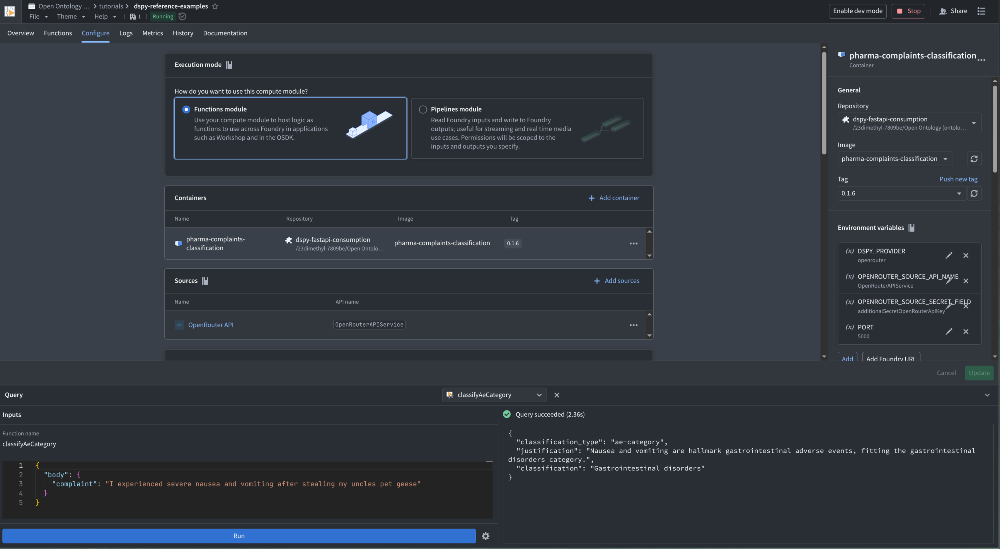
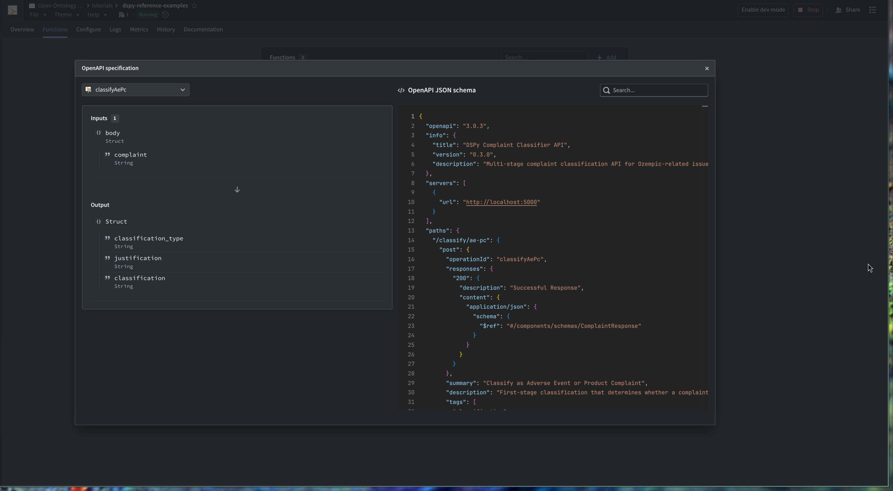
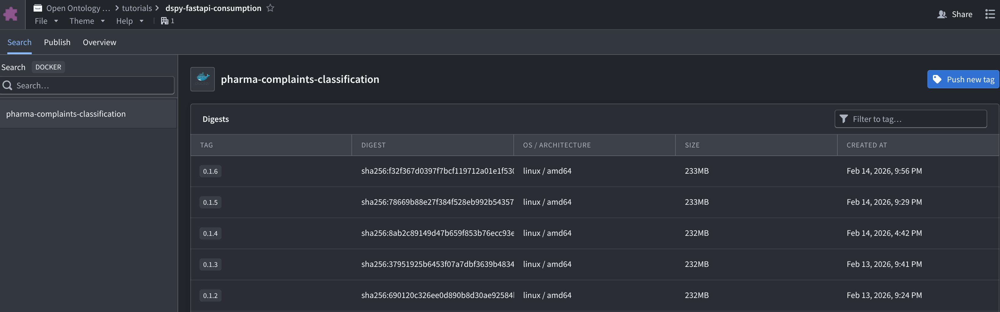

# Foundry Auto-Deploy (OpenAPI -> Functions)

This repo is set up so a tagged release can publish a Docker image to Foundry and make its FastAPI routes importable as Foundry **functions**.

The key idea: publish a container image that includes a Foundry-compatible OpenAPI contract (as the `server.openapi` image label). In Foundry, you can then run **Detect from OpenAPI specification** to auto-register the functions.

## What You Get

- A deterministic OpenAPI surface area (`openapi.foundry.json`) for Foundry import.
- A container image with the OpenAPI contract embedded in metadata.
- UI-driven function registration from the contract (no handwritten wrappers).

## How It Works (High Level)

1. Generate a Foundry-constrained OpenAPI spec.
2. Build a linux/amd64 image that embeds the spec as `server.openapi`.
3. Push the image to a Foundry Artifact Repository.
4. In Foundry Compute Modules, link the image tag and run **Detect from OpenAPI specification**.

## Screenshots

Compute module function-call flow (functions module + query panel):



OpenAPI schema view inside Foundry (this is the contract Foundry imports):



Artifact repository tags (images pushed by CI/CD show up here):



Add any additional Foundry UI screenshots to `assets/` and reference them from this doc and `README.md`.

## Commands (Local)

Generate and validate the Foundry-constrained OpenAPI artifact:

```bash
uv run python scripts/deploy/foundry_openapi.py --generate --spec-path openapi.foundry.json
uv run python scripts/deploy/foundry_openapi.py --spec-path openapi.foundry.json
```

Build an image that includes the OpenAPI as metadata:

```bash
export OPENAPI_JSON="$(uv run python -c 'import json; print(json.dumps(json.load(open("openapi.foundry.json", encoding="utf-8")), separators=(",", ":")))')"

docker buildx build \
  --platform linux/amd64 \
  --build-arg SERVER_OPENAPI="${OPENAPI_JSON}" \
  --tag "<registry>/<repo>/<image>:<tag>" \
  --load \
  .
```

## CI/CD (Recommended)

- `/.github/workflows/publish-foundry.yml` publishes to Foundry on tag builds (`v*`).
- `/.github/workflows/release-version.yml` can auto-create a `vX.Y.Z` tag after CI passes on `main`.

Foundry workflow docs live in:

- `docs/deploy-ci.md`
- `docs/foundry-openapi-runbook.md`

## Auth Notes

For CI, prefer a dedicated non-admin Foundry user that has **Edit** permission on the target Artifact Repository. Generate a long-lived token as that user and store it as the GitHub secret `FOUNDRY_TOKEN`.
